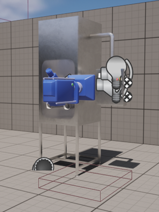

Задачей является смоделировать панель управления, с отдельными элементами, чтобы кнопки были подвижными, каждая должна быть как отдельна, но соразмерная модель. 
Добавить панель в движок, сделать переключение «вида» чтобы камера переносиласть на панель, сделать возможность того, чтобы кнопки на панели были кликабельные и 
воспроизводили анимацию нажатия на них, с подсветкой, где это необходимо.

Первым шагом необходимо создать модели самой панели управления с кнопками, а также примитивную модель изолятора в одном из 3D редакторов. Для данной задачи был выбран Blender 3D. 
Далее надо перенести полученные модели в игровой движок, а также разместить из на сцене. На рис. 1 изображена модель изолятора на игровой сцене.

   

   <figcaption>Деревянная скульптура</figcaption>
