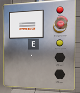
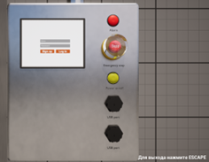
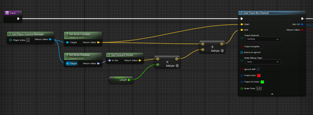
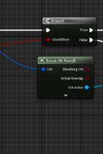
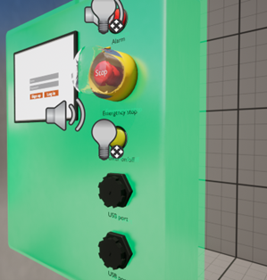
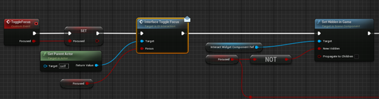
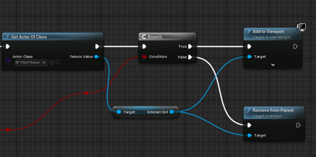
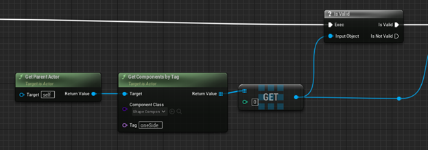
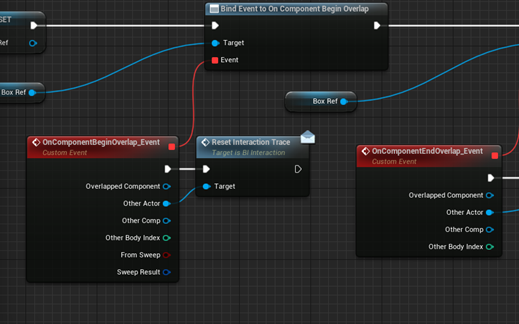
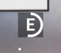

Задачей является смоделировать панель управления, с отдельными элементами, чтобы кнопки были подвижными, каждая должна быть как отдельна, но соразмерная модель. 
Добавить панель в движок, сделать переключение «вида» чтобы камера переносиласть на панель, сделать возможность того, чтобы кнопки на панели были кликабельные и 
воспроизводили анимацию нажатия на них, с подсветкой, где это необходимо.

Первым шагом необходимо создать модели самой панели управления с кнопками, а также примитивную модель изолятора в одном из 3D редакторов. Для данной задачи был выбран Blender 3D. 
Далее надо перенести полученные модели в игровой движок, а также разместить из на сцене. На рис. 1 изображена модель изолятора на игровой сцене.

Рис. 1. Модель изолятора на игровой сцене

 

Сам шкаф просто перетаскивается на сцену, а для панели управления необходимо создать отдельный Blueprint class для того, чтобы иметь возможность взаимодействовать с этой панелью. Именно в этом классе будет описываться основная логика проекта.

То есть, когда игрок подходит к панели спереди, она подсвечивается и на экране загорается клавиша E, как изображено на рис. 2. После того, как он зажмет эту клавишу, камера переместится на панель управления и тогда появится курсор, с помощью которого и происходят нажатия на кнопки, как на рис. 3.

Рис. 2. Клавиша E

 

Рис. 3. Перемещение камеры на панель

 

Для того, чтобы реализовать такую возможность, сначала необходимо каким – либо образом научиться обнаруживать объекты, с которыми можно взаимодействовать. Одним из таких способов является выпускание невидимого для игрока луча с некоторой периодичностью, как правило она равна числу текущих кадров в минуту. Создается отдельная функция, в которой и формируется луч. Это изображено на рис. 4..Получаем центр камеры игрока в качестве начала луча, а в качестве его конца просто задаем некоторое произвольное значение в переменной Length. А сам объект, который и обнаружил луч извлекается функцией Break Hit Result, как на рис. 5.

Рис. 4. Функция формирования луча

 

Рис. 5. Луч извлекается функцией Break Hit Result

 

Однако для того, чтобы не писать один и тот же код для каждого отдельного интерактивного объекта я поступил следующим образом. Луч направляется не на сам объект, а на его невидимую копию, расположенную поверх него. Видимость отключается и включается в настройках, с помощью заранее созданной логической переменной и конструктора класса. Это изображено на рис. 6. 

Рис. 6. Невидимая копия объекта

 

Создаются два blueprint класса: BP_InteractionArea_Master и BP_InteractionArea_CustomShape. В первом классе прописывается основная логика поведения при наведении луча на объект (загорание виджета с клавишей E), во втором – задание формы и материала для невидимой копии объекта.

Разберем немного подробнее класс BP_InteractionArea_Master. В этом классе есть два события.  Первое событие обрабатывает луч и дает возможность взаимодействовать с объектом, как на рис. 7 и рис. 8.

Рис. 7. Обработка луча

 

Рис. 8. Возможность взаимодействия с объектом

 

Второе же событие проверяет наличие коллизионной зоны у объекта. Она нужна для включения возможности взаимодействия с объектом только с определенной стороны. Если эта зона существует, и игрок находится в ней, то с объектом можно производить действия. Blueprint изображён на рис. 9 и на рис. 10.

Рис. 9. Проверка коллизионной зоны у объекта

 

Рис. 10. Проверка коллизионной зоны у объекта

 

После того как пользователь навелся на объект и появилась кнопка взаимодействия, я реализовал отображение виджета прогресса для того, чтобы, в случае, когда пользователь случайно нажал на клавишу E переход в режим управления изолятором не начался, для перехода необходимо именно зажать эту клавишу. Это изображено на рис. 11.

Рис. 11. Отображение виджета прогресса

 
