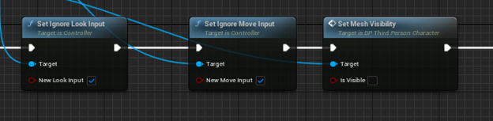

<a href="https://www.youtube.com/watch?v=xqjl-PWhVFY" target="_blank">Ссылка на демонстрацию работоспособности проекта</a>

 

Задачей является смоделировать панель управления, с отдельными элементами, чтобы кнопки были подвижными, каждая должна быть как отдельна, но соразмерная модель. 
Добавить панель в движок, сделать переключение «вида» чтобы камера переносиласть на панель, сделать возможность того, чтобы кнопки на панели были кликабельные и 
воспроизводили анимацию нажатия на них, с подсветкой, где это необходимо.

Первым шагом необходимо создать модели самой панели управления с кнопками, а также примитивную модель изолятора в одном из 3D редакторов. Для данной задачи был выбран Blender 3D. 
Далее надо перенести полученные модели в игровой движок, а также разместить из на сцене. На рис. 1 изображена модель изолятора на игровой сцене.

Рис. 1. Модель изолятора на игровой сцене

 

Сам шкаф просто перетаскивается на сцену, а для панели управления необходимо создать отдельный Blueprint class для того, чтобы иметь возможность взаимодействовать с этой панелью. Именно в этом классе будет описываться основная логика проекта.

То есть, когда игрок подходит к панели спереди, она подсвечивается и на экране загорается клавиша E, как изображено на рис. 2. После того, как он зажмет эту клавишу, камера переместится на панель управления и тогда появится курсор, с помощью которого и происходят нажатия на кнопки, как на рис. 3.

Рис. 2. Клавиша E

 

Рис. 3. Перемещение камеры на панель

 

Для того, чтобы реализовать такую возможность, сначала необходимо каким – либо образом научиться обнаруживать объекты, с которыми можно взаимодействовать. Одним из таких способов является выпускание невидимого для игрока луча с некоторой периодичностью, как правило она равна числу текущих кадров в минуту. Создается отдельная функция, в которой и формируется луч. Это изображено на рис. 4..Получаем центр камеры игрока в качестве начала луча, а в качестве его конца просто задаем некоторое произвольное значение в переменной Length. А сам объект, который и обнаружил луч извлекается функцией Break Hit Result, как на рис. 5.

Рис. 4. Функция формирования луча

 

Рис. 5. Луч извлекается функцией Break Hit Result

 

Однако для того, чтобы не писать один и тот же код для каждого отдельного интерактивного объекта я поступил следующим образом. Луч направляется не на сам объект, а на его невидимую копию, расположенную поверх него. Видимость отключается и включается в настройках, с помощью заранее созданной логической переменной и конструктора класса. Это изображено на рис. 6. 

Рис. 6. Невидимая копия объекта

 

Создаются два blueprint класса: BP_InteractionArea_Master и BP_InteractionArea_CustomShape. В первом классе прописывается основная логика поведения при наведении луча на объект (загорание виджета с клавишей E), во втором – задание формы и материала для невидимой копии объекта.

Разберем немного подробнее класс BP_InteractionArea_Master. В этом классе есть два события.  Первое событие обрабатывает луч и дает возможность взаимодействовать с объектом, как на рис. 7 и рис. 8.

Рис. 7. Обработка луча

 

Рис. 8. Возможность взаимодействия с объектом

 

Второе же событие проверяет наличие коллизионной зоны у объекта. Она нужна для включения возможности взаимодействия с объектом только с определенной стороны. Если эта зона существует, и игрок находится в ней, то с объектом можно производить действия. Blueprint изображён на рис. 9 и на рис. 10.

Рис. 9. Проверка коллизионной зоны у объекта

 

Рис. 10. Проверка коллизионной зоны у объекта

 

После того как пользователь навелся на объект и появилась кнопка взаимодействия, я реализовал отображение виджета прогресса для того, чтобы, в случае, когда пользователь случайно нажал на клавишу E переход в режим управления изолятором не начался, для перехода необходимо именно зажать эту клавишу. Это изображено на рис. 11.

Рис. 11. Отображение виджета прогресса

 

Это событие называется TryToInteract. На вход оно получает логическую переменную и, если она равна истине, то взаимодействие продолжается, если нет, то оно заканчивается, как на рис. 12. Далее проверяем, навелся ли игрок на объект, если да, узнаем время необходимое для зажатия клавиши E. Если оно равно нулю, то переход в режим управления изолятором произойдет сразу, в противном случае начнется заполнение круга виджета прогресса. Blueprint изображён на рис. 13.

Рис. 12. Получение логической переменной и проверка на истинность

 

Рис. 13. Проверка логической переменной

 

Для его заполнения получаем на него ссылку и устанавливаем таймер. С помощью нехитрых математических вычислений обновляем прогресс заполнения виджета. Это изображено на рис. 14 и на рис. 15.

Рис. 14. Установка таймера и обновление прогресса заполнения виджета

 

Рис. 15. Обновление прогресса заполнения виджета

 

Как только прогресс стал больше или равным единице, он обнуляется и вызывается функция взаимодействия, которая для каждого объекта может выполнять совершенно разные действия. Достаточно только реализовать интерфейсную функцию InterfaceInteract. Эта самая функция изображена на рис. 16 и вызывается при помощи события InteractOnServer, которая изображена на рис. 17.

Рис. 16. Функция InterfaceInteract

 

Рис. 17. Событие InteractOnServer

 

Такое усложнение будет необходимым в том случае, когда игра будет запускаться с несколькими игроками, чтобы двум и более игрокам нельзя было взаимодействовать с объектом одновременно.

Теперь можно создавать новый blueprint класс, в котором и будет создана панель управления изолятором и реализована вся логика ее работы, а затем расположена на игровой сцене. 

Начнем с реализации взаимодействия. После того как пользователь зажал клавишу E, происходят следующие действия: отключается возможность управления персонажем, он становится невидимым, появляется курсор мыши, затем происходит переход камеры на саму панель и скрываются ненужные элементы, такие, как обводка контура панели и виджет взаимодействия. Изображено на рис. 18. Для перехода обратно в режим ходьбы по сцене пользователь должен нажать на клавишу escape на клавиатуре, и камера перейдет обратно, а скрытые элементы вновь появяются. Blueprint изображён на рис. 19.

Рис. 18. Отключение возможности управления персонажем

 

Рис. 19. Скрытые элементы вновь появляются

 

Для того чтобы игрок понял, на какие элементы можно нажимать при наведении курсора мыши на них их контуры подсвечиваются, например, как на рис. 20. Это реализуется с помощью событий OnBeginCursorOver и OnEndCursorOver, которые и вызывают функции отображения этих самых контуров и изображены на рис. 21. Нажатие на элементы управления происходит при клике на левую кнопку мыши.

Рис. 20. Наведение курсора мыши и подсветка контура

 

Рис. 21. События OnBeginCursorOver и OnEndCursorOver

 

Разберем логику нажатия на элементы панели управления изолятором на примере кнопки включения/выключения аварийной сигнализации. После клика на мышь воспроизводится звук нажатия на кнопку, затем устанавливается значение переменной, хранящей текущее состояние (в данном случае, включена ли сигнализация). Blueprint изображён на рис. 22.

Рис. 22. Клик на мышь и воспроизведение звука

 

Далее производится анимация нажатия на кнопку, которая работает следующим образом. Заранее создается таймлайн, который хранит координаты кнопки в определенный момент времени. Вызывается функция изменения положения кнопки в пространстве и в нее передаются эти координаты. Это изображено на рис. 23. Далее устанавливается задержка для того, чтобы анимация успела проиграть до совершения последующих действий, как на рисунке рис. 24.

Рис. 23. Создается таймлайна и вызов функции изменения положения кнопки в пространстве

 

Рис. 24. Задержка для того, чтобы анимация успела проиграть до совершения последующих действий

 

Затем, если сигнализация включена, добавляем кнопке подсветку, в противном же случае выключаем ее. Здесь для большего эффекта также было добавлено мерцание кнопки путем создания все того же таймлайна и изменения интенсивности света от 0 до 50 единиц, как на рис. 25. Последним действием является воспроизведение звука тревоги, что изображено на рис. 26.

Рис. 25. Добавление подсветки кнопке

 

Рис. 26. Воспроизведение звука тревоги.

 

Та же логика нажатия прослеживается в остальных элементах управления. Для кнопки включения/выключения насосов также воспроизводится анимация нажатия, однако она не мерцает, а просто горит. Кнопка экстренного выключения помимо отключения звука насосов также убирает подсветку кнопки включения/выключения насосов. А крышки USB портов просто воспроизводят звук взаимодействия и анимацию перемещения и вращения, как на рис. 27.

Рис. 27. Звук взаимодействия и анимация перемещения и вращения 

 
